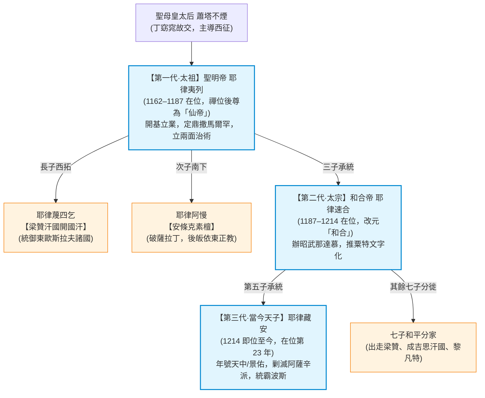

# 昭武帝國 (Zhaowu Empire)

> 「絲路經天中，確為我昭武所控；但絲路天東也為大蜀所控。路要所有人都想走，才能通。若昭武斷了大蜀生路，昭武自己亦無路走。寡人在世一日，昭武必與東西和好。」
> ——昭武太宗 和合帝 耶律速合，1189 年接見大蜀使臣

**昭武帝國**（西方史載稱「**粟特大契丹國**」），是由契丹皇族耶律氏於 1162 年在中亞河中與七河流域建立的橫跨歐亞超級征服與文明帝國。其核心疆域統有河中、七河、蔥嶺東西、準噶爾盆地，並實質宰制波斯高原與欽察草原。

昭武帝國不同於正史西遷逃難的西遼（喀喇契丹），其立國乃是一場主動出擊的文明遠征。在近百年歷史中，昭武帝國融合游牧機動與綠洲農商，創設「行國居國兩面治術」與「粟特字母拼寫化」，更藉由獨特的「皇子出境分立傳統」，將政治與軍事影響力深遠輻射至東歐梁贊、敘利亞黎凡特、北德意志波美拉尼亞，乃至乘船抵達北美大平原，深刻改寫了 12 至 13 世紀的世界歷史格局。

---

## 一、 立國背景與法統源流

### 1. 大遼未亡與大石宗祖
在本世界線中，**大遼並未滅亡於女真**，辽金兩國在太陽國等外部力量斡旋下實現長期和平共存。
- 正史西征的**耶律大石**並未西逃，而是以契丹首位進士之身輔佐朝政，善終後安葬於遼上京陵寢。
- 昭武帝國皇族系出大遼宗室，昭武歷代君主始終奉東方大遼為「大宗賢侄國」，昭武自稱「西宗叔國」，兩國世代結盟修好，互通鐵路與商賈。

### 2. 蕭塔不煙與丁窈窕的世界精神
1162 年（[[創作/fiction/Green & Umin/4|第 4 部]] Turn 132），契丹宗室雄主**耶律夷列**不甘於守成東北亞，立志開闢前所未有之西域基業。
- 其生母**聖母皇太后 蕭塔不煙**早年長居北京，為傳奇聖女**丁窈窕**（Fatima ad-Din）之摯友與得意門徒。
- 蕭塔不煙深受丁窈窕博愛萬方、不拘族群偏見的世界主義思想啟蒙，極力促成耶律夷列率部西遷，將「融合四海、保境安民」的博愛胸懷刻入昭武立國憲章之中。

### 3. 定鼎撒馬爾罕
1162 年，耶律夷列奉母西出蔥嶺，統率契丹、女真八部鐵騎越過天山，於河中會戰擊破西喀喇汗國與塞爾柱突厥殘部，受河中諸綠洲城邦推舉即位稱帝。
- **國號**：定國號為**「昭武」**，借取西域「昭武九姓」之名，象徵胡夏融合、光昭武德。
- **都城配置**：
  - **常都（冬都）**：**撒馬爾罕**（Samarkand），坐鎮河中綠洲農業與東西商貿心臟。
  - **夏都（東都）**：**八剌沙袞 / 虎思斡耳朵**（Balasagun / Huzsi Ordo），便於就近調控七河草原游牧部族。

---

## 二、 國家制度與文明治理

### 1. 「行國、居國兩面治術」
昭武帝國完美汲取契丹傳統並因地制宜，創立了超越亞歷山大帝國與阿巴斯哈里發國的**「兩面治術」**：
- **行國治術（針對游牧民族）**：
  - 統御七河流域、欽察草原、準噶爾與哈薩克草原的游牧部族（突厥、契丹、女真、蒙古、庫曼等）。
  - 實行招討司、千戶與萬戶軍政合一體制，保障各部放牧權限，不強制干涉游牧傳統生活方式。
- **居國治術（針對農商定居民族）**：
  - 統御河中、費爾干納、波斯與阿富汗之綠洲農業與繁華商埠。
  - 設行在官署、府庫、提刑司，尊重伊斯蘭卡迪裁判體系與波斯官僚行政，減免關稅、鼓勵跨國貿易。

### 2. 語文革命：粟特字母拼寫化
面對遼金東北亞部眾、中亞突厥、粟特、波斯多語並存的複雜現實，昭武帝國自太宗起推動劃時代的語文規範：
- **粟特字契丹文 / 女真文**：正式以流暢便利的「粟特字母」全面取代難寫難辨的原生契丹大/小字與女真字，確立為帝國最高官方文書語文。
- **商貿通用語**：境內保留以阿拉伯字母拼寫之波斯語（Farsi）作為商貿與日常行政通用語。
- **學術與出版**：編纂《地圓東西眾文通》（以波斯語、粟特字母契丹語對譯各族詞彙），設立「諸胡印局」，大量吸納東方活版印刷術印行各族法典。

### 3. 避免內耗的「去國分家制度」
為了徹底破解游牧帝國在權力交接時屢見不鮮的「諸子奪嫡內戰」，昭武帝國立下鐵律憲制：
- **一帝承統**：每一代僅立一名皇子繼承撒馬爾罕大統。
- **皇子去國拓疆**：其餘無繼承權之皇子，由國庫配予豐厚銀錢金帛、私屬親軍與千戶部曲，**自願選擇去國向外擴張**，且各分支與昭武本朝平等建交，系出同源，永不操戈。
- 此舉使得昭武皇族如同蒲公英種子般散落西亞與東歐，化內部奪位隱患為向外擴張的澎湃動力。

---

## 三、 正統帝系世系表（1162–1237 年）

自 1162 年立國至 1237 年（Turn 207），昭武帝國**僅傳三代**，皇位更迭平穩，國力步步攀升：

### 1. 第一代·開國太祖：聖明帝 耶律夷列（1162–1187 年在位，尊為「仙帝」）
- **生平功績**：立國始祖。統帥聯軍越蔥嶺定鼎中亞，營建撒馬爾罕，降伏西喀喇汗國，確立行國居國體制。
- **仙帝東遊之壯舉**：
  - 1187 年（Turn 157）禪位太子速合，與皇后蕭莫薩俞自號「仙帝、仙后」。
  - 晚年乘火車重返東北亞故土，於遼上京大石列祖陵前痛哭撫石告慰「未辱契丹名聲」；走訪金國獲女真宗親隆重接見；並親赴大蜀北京會晤綠清旋龍，共倡「夏胡論壇」。

### 2. 第二代·太宗：和合帝 耶律速合（1187–1214 年在位，在位 27 年）
- **生平功績**：太祖第三子，1176 年立為皇太子，1186 年攝政，1187 年即位改元「和合」。
- **多元和諧之道**：
  - 熟稔突厥語、波斯語，創辦首屆「昭武那達慕」，使中亞各族融洽相處。
  - 奠定絲路互利原則，善待大蜀商旅，維持歐亞和平長達近三十年。
  - 晚年親赴巴格達展開國事訪問，與二哥安條克素檀耶律阿慢在兩河流域相擁話舊。

### 3. 第三代·當今天子：耶律藏安（1214 年即位至今，在位第 23 年，年號天中/景佑）
- **生平功績**：太宗第五子。1214 年遵太宗遺詔繼位，其餘兄弟和平分徙，政局無震盪。
- **武功與文治極盛**：
  - **花剌子模弭兵**：新帝親征鹹海叛亂，臨陣以感化相擁代替屠殺，和平化解突厥騷亂。
  - **覆滅阿薩辛派**：1217 年（Turn 187）揮軍踏平阿刺模忒堡，將荼毒中東的極端刺客組織「山中老人」徹底滅絕，並與太陽國合作將俘虜流放重洋。
  - **波斯霸權與帕米爾劃界**：大破阿巴斯與塞爾柱聯軍，將波斯納入直接勢力圈；與大蜀帝國在帕米爾高原（蔥嶺）及喀什米爾進行和平劃界。
  - **文教與交鈔**：在撒馬爾罕成立皇家學府與綜合天文台，編纂《天中文明全書》；設立官辦兌換所，發行以生絲與白銀儲備的「昭武通行交鈔」。

---

## 四、 皇族分支政權與全球輻射

昭武帝國獨特的和平分家制度，促成了 12 世紀末至 13 世紀歐亞與跨洋板塊上的巨大連鎖效應：

| 分支政權 / 武裝集團                        | 開創者 / 核心人物          | 地理領域                | 歷史角色與影響                                                             |
| :--------------------------------- | :------------------ | :------------------ | :------------------------------------------------------------------ |
| **梁贊汗國** (Ryazan Khanate)      | 耶律蔑四乞 (太祖長子)    | 東歐羅斯平原 (梁贊、莫斯科) | 征服並統治東斯拉夫諸公國，與昭武本朝並稱兄弟宗邦。曾重金僱用鐵木真 3 萬戶蒙古傭兵出征東歐。現任第三代汗為耶律索阿莫。        |
| **安條克素檀國** (Antioch Sultanate) | 耶律阿慢 (太祖次子)     | 黎凡特敘利亞山區 (安條克)  | 率東方精騎正面重創薩拉丁，後皈依東正教，結盟拜占庭帝國，成為黎凡特十字軍與伊斯蘭諸國間的強大樞紐。                   |
| **波美拉尼亞公國** (Tschinvoschon 家族) | 完顏陳和尚 (昭武女真籍名將) | 神羅北德意志、波美拉尼亞        | 受神羅皇帝封為波美拉尼亞公爵，組織「斯德丁兄弟會」義子騎士團；透過聯姻波希米亞國王之女插足歐洲宮廷，位列神羅霸主諸侯。         |
| **菲仕蘭十千戶** (De Tjenthûsenden)  | 粘猛可等千戶長             | 低地國菲仕蘭海濱 (荷蘭北部) | 昭武駐中歐雇傭騎兵駐牧地，吸收菲仕蘭日耳曼人形成混血精銳輕騎，成為低地與北海各王公倚重之保安力量。                   |
| **北美昭武牛仔** (Zhaowu Cowboys)    | 菲仕蘭昭武逃兵 / 探險者       | 北美密西西比河西岸、大平原       | 隨太陽國商船抵達美洲，深入內陸將「馬匹、複合弓與游牧獵牛」傳授給蘇族（Sioux）與阿帕契等原住民，提前 600 年造就北美騎兵文明。 |

---

## 五、 宗教與思想底色

昭武帝國延續了中亞樞紐的多元與開放，皇室與民間展現出極致的信仰寬容：
1. **景教（聶斯脫里派）**：在耶律皇族與宮廷內佔有崇高地位，撒馬爾罕設有景教牧首，主持新帝祈福典禮。
2. **伊斯蘭教**：尊重境內廣大穆斯林民眾，任命卡迪依法斷案，維護哈里發與各蘇丹名義宗教地位。
3. **佛教與薩滿教**：契丹、女真功臣與西域各部保留原有圖騰與信仰自由，年年舉行那達慕大會歡聚。
4. **博愛傳承**：自蕭塔不煙太后起，深受大蜀丁窈窕世界主義思潮浸潤，昭武朝廷崇尚「以德懷遠、四海通商」，極力避免種族滅絕與宗教迫害，成為中古黑暗時代中難得的歐亞知識與文明庇護所。
